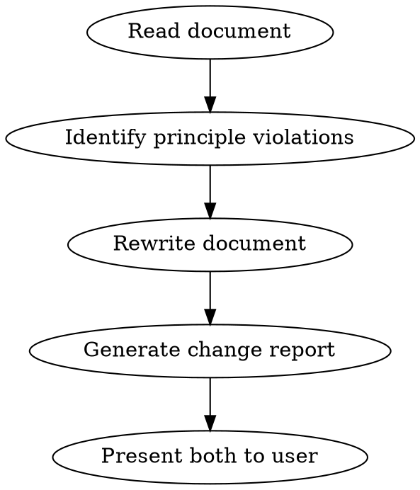

# plsfix

## Overview

Improve spec and instruction documents by applying the 12 principles that make both human and AI communication effective. Produces a rewritten document plus a change report mapping each edit to the principle it implements.

**Core insight:** The same writing principles that make humans respond better also make AI respond better, because LLMs learned from human text. These principles aren't prompt tricks: they're the fundamentals of effective written communication.

**Sources:** These principles are synthesized from official prompt engineering guidance published by [Anthropic](https://platform.claude.com/docs/en/build-with-claude/prompt-engineering/overview), [Google](https://ai.google.dev/gemini-api/docs/prompting-strategies), [OpenAI](https://platform.openai.com/docs/guides/prompt-engineering), and [Microsoft](https://learn.microsoft.com/en-us/azure/ai-foundry/openai/concepts/prompt-engineering).

## When to Use

- Spec or requirements document feels vague or produces bad results
- Instructions to a team or AI keep getting misinterpreted
- Prompt or brief generates generic, off-target output
- Document has grown organically and lost coherence
- User says "fix this", "improve this", "make this clearer" about an instruction document

## Flags

### `--help`

If the user invokes this skill with a `--help` flag (e.g. `/plsfix --help`), do not run the workflow. Instead, read and display the contents of `help.md` (in this skill's folder) verbatim, then stop.

### `--version`

If the user invokes this skill with a `--version` flag (e.g. `/plsfix --version`), do not run the workflow. Instead:

1. Read the installed version from this skill's own manifest: `.claude-plugin/plugin.json` if present, else `.codex-plugin/plugin.json`, else `gemini-extension.json` — whichever exists for this platform install. If none exist (a bare Claude Code skill with only SKILL.md), read the topmost version heading in `CHANGELOG.md` instead.
2. Print: `plsfix v<installed-version>`
3. Best-effort update check — determine this skill's GitHub source repo:
   a. If `.git` exists here and `git remote get-url origin` resolves to a `github.com` URL, use that `owner/repo`.
   b. Otherwise, search this skill's own `README.md` for the first `https://github.com/<owner>/<repo>` URL and use that.
   c. If neither yields a repo, or the `gh` CLI isn't installed/authenticated: stop here. Print nothing further — no status line, no error.
4. If a repo was found: run `gh api repos/<owner>/<repo>/releases/latest -q .tag_name` (strip a leading `v`). Compare to the installed version:
   - Equal → append: `Status: up to date`
   - Installed is older → append: `Status: newer version available (v<latest>). To update: if you installed this via a Claude Code marketplace, run /plugin marketplace update <marketplace-name> then reinstall; otherwise, git pull in your install directory if it's a git checkout, or re-copy from https://github.com/<owner>/<repo> per this README's Installation section.`
   - Installed is newer → append: `Status: ahead of latest release (development checkout)`
   - If the API call fails for any reason (network, auth, rate limit, malformed tag): print nothing further — no status line, no error shown to the user.
5. Stop — do not proceed to run the skill's actual workflow.

## The 12 Principles

Principles are ordered by application sequence: structure the document first (P1-P4), then sharpen content (P5-P8), then refine delivery (P9-P12). Read `references/principles.md` (in this skill's folder) for the full table of each principle, its one-liner, and the symptom/diagnostic that indicates it applies — consult it during Step 1 below.

## Workflow



### Step 1: Read and Diagnose

Read the full document. For each section or paragraph, check against all 12 principles in order: Structure (P1-P4), then Content (P5-P8), then Delivery (P9-P12). Note every violation with its location and the principle it violates.

### Step 2: Rewrite

Apply fixes to produce a clean, improved version of the document. Preserve the author's intent, voice, and structure where possible. Make the minimum changes needed to satisfy each principle.

**Rewriting rules:**
- Do not add content the author didn't intend (no scope creep)
- Do not remove content unless it directly contradicts a principle (e.g., removing a "don't" to replace with a positive directive)
- When adding specificity (P5), mark any assumed details with `[CONFIRM: assumed detail]` so the author can verify
- When adding examples (P8), draw them from context in the document itself; if no context exists, mark with `[EXAMPLE NEEDED: describe what kind]`
- When adding structural markup (P4), prefer the delimiter style already used in the document; if none exists, use markdown headers for human-facing docs and XML tags for AI-facing prompts
- When adding an output contract (P7), derive format and constraints from what the document already implies; mark assumptions with `[CONFIRM]`
- Preserve original section headings unless renaming is required to fix P2 (one ask per section)

### Step 3: Generate Change Report

Produce a markdown table summarizing every change:

```
## plsfix Change Report

| # | Location | Principle | Before (summary) | After (summary) | Rationale |
|---|----------|-----------|-------------------|-----------------|-----------|
| 1 | Section 2, para 1 | P5: Be specific | "Build a good dashboard" | "Build a Grafana dashboard showing p95 latency, error rate, and throughput for the payments service" | Original lacked target tool, metrics, and scope |
| 2 | Section 3 | P9: Say what to do | "Don't use jargon" | "Use plain language a non-technical stakeholder would understand" | Negative instruction replaced with positive directive |
| 3 | Section 1 | P4: Use structural markup | Instructions, context, and examples mixed in a single block | Separated with `### Instructions`, `### Context`, and `### Examples` headers | Reader couldn't distinguish instructions from reference material |
```

**Report rules:**
- One row per change (group tightly related changes on the same sentence)
- Always cite the principle by number and name
- "Before" and "After" should be short summaries or direct quotes, not full paragraphs
- "Rationale" explains why this change improves the document in one sentence
- If no violations are found for a principle, do not include a "no changes" row; omit silently
- End the report with a **Principles Not Triggered** line listing any of P1-P12 that required no changes (confirms you checked)

### Step 4: Present

Show the user:
1. The change report (so they can review what changed and why)
2. The rewritten document (full text, ready to use)

Ask: *"Any of the [CONFIRM] items to adjust, or changes you'd like to revert?"*

## Common Mistakes

- **Over-specifying:** Adding so much detail that the document becomes brittle and can't adapt to context. Fix: use `[CONFIRM]` tags for assumptions rather than asserting details you don't know.
- **Rewriting voice:** Stripping the author's tone and replacing it with generic "spec language." Fix: match the original register; if it was casual, keep it casual but clearer.
- **Inventing scope:** Adding requirements the author never mentioned because "they should have." Fix: only add specificity that clarifies existing intent, never new intent.
- **Principle-stuffing:** Forcing every principle into every section even when the original was fine. Fix: if it ain't broke, don't fix it. Report only actual violations.
- **Over-structuring:** Adding XML tags and delimiters to a simple, short document that was already clear. Fix: structural markup (P4) helps most when the document is long or mixes multiple content types. A three-sentence instruction doesn't need headers.
